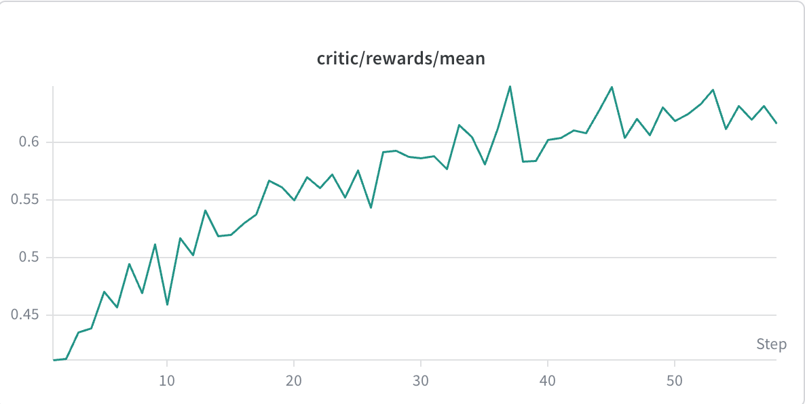
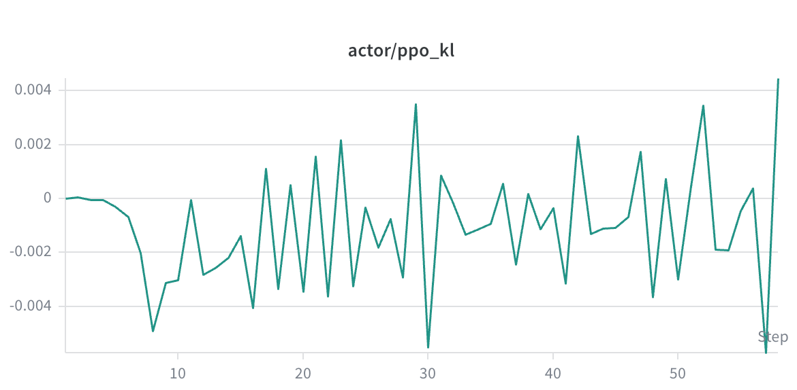
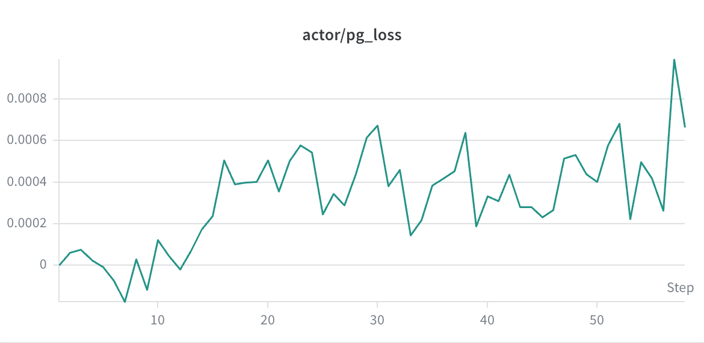
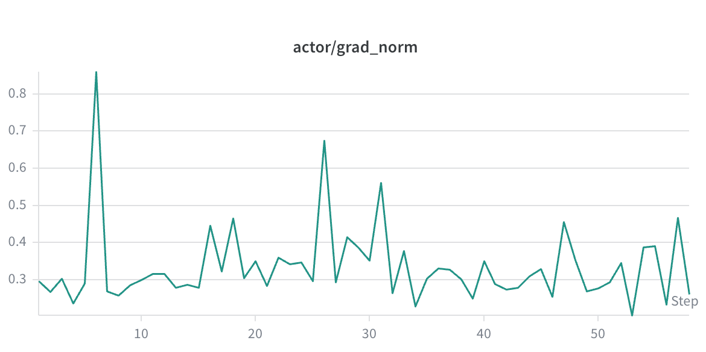
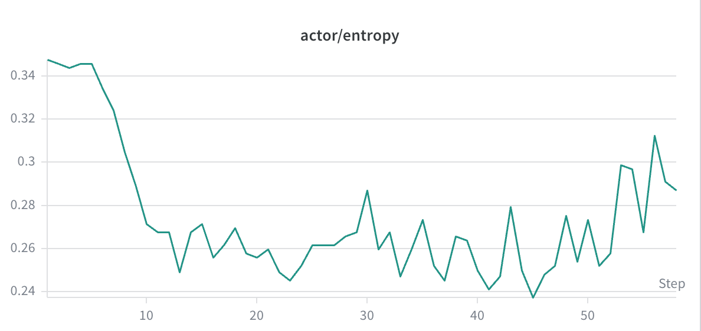
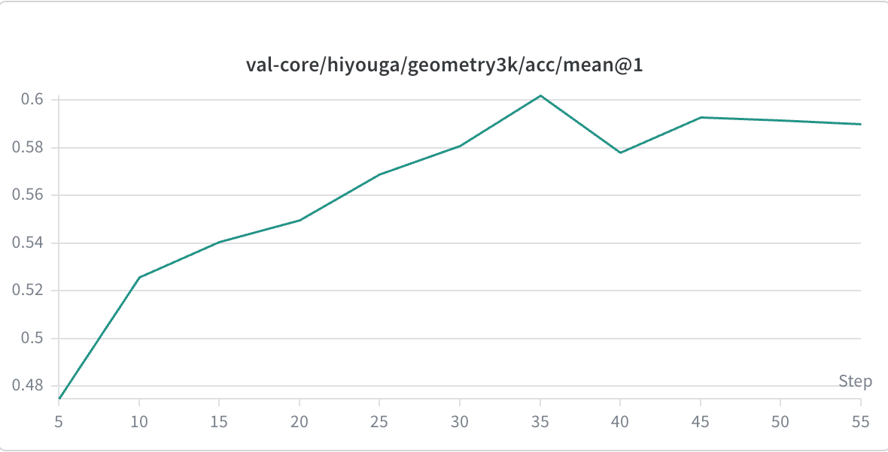

# Qwen3vl 8b on Kunlun p800
本recipe是基于qwen3vl-8b模型在p800上进行RLHF后训练的样例，基于GRPO与规则奖励，使用geo3k数据集。
## 依赖的 `verl` 版本

请参阅本目录下的 [`REQUIRED_VERL.txt`](REQUIRED_VERL.txt)，了解上游仓库、`main` 滚动开发或固定 tag/commit 的安装方式，以及可复制的 `pip` / `git` 命令。

## 训练细节
### 训练超参

本样例基于qwen3vl-8b模型在geo3k数据集上训练，使用简单的格式奖励和结果准确率奖励，训练超参如下：

|  迭代  | 学习率 |  gbs  |  采样数 | 温度 |  kl-coef | 输入长度 | 输出长度 | 规则奖励 | 奖励模型 |
|:----:|:----:|:----:|:----:|:----:|:----:|:----:|:----:|:----:|:----:|
| 60 | 1e-6 |  512  |  5  |  1.0  |  0.001  |  1024  |  2048  |  format + acc  | - |

### 训练资源与性能
本样例在昆仑p800服务器上进行训练，使用了8张p800。具体的部署方式如下：

| Rollout部署 | Actor部署 | Reference部署 | Offload策略 |
|:----:|:----:|:----:|:----:|
|  TP4 DP2  |  TP1 DP8  |  同Actor  |  全offload |

得到一步的训练性能如下（吞吐会随着训练中模型输出长度变化而改变）：
| 平均问题长度 |  平均回复长度  |  单步总耗时(s) | 吞吐(tps/p800) | gen耗时(s) | reward耗时(s) | old_prob耗时(s) | ref_prob耗时(s) | update耗时(s) |
|:----:|:----:|:----:|:----:|:----:|:----:|:----:|:----:|:----:|
| 207.3 |  556.5  |  1864.7  | 95.5 |  486.7  |  0.00009  |  249.5  |  384.5  | 729.9 |

### 训练过程记录
<div align="center">
  
  
  
</div>
<div align="center">
  
  
  
</div>

## 快速开始

### 环境准备
verl上的p800环境准备，可使用我们提供的Dockerfile在本地构建项目运行环境：`docker build -f Dockerfile.kunlun_verl-0.8.0.torch2.9 -t REPOSITORY:TAG ./`。
进入容器后，需要在目录`/workspace/vllm`下运行 `bash scripts/build.sh build`完成vllm安装。

### 准备训练数据集
本样例使用geo3k数据集。准备方式如下：
```bash
wget https://klx-sdk-release-public.su.bcebos.com/v1/xav/data/geo3k.tar.gz
tar -xzf geo3k.tar.gz
```


### 准备模型权重
本样例使用qwen3vl-8b模型。准备方式如下：
```bash
pip install modelscope
modelscope download --model Qwen/Qwen3-VL-8B-Instruct
```

### 执行RL后训练
```bash
# verl目录下启动qwen3vl 8b的RL后训练，需要替换脚本中的wandb key，以及数据集、模型路径
ray start --head --num-gpus=8
bash ./recipe/kunlun/run_qwen3vl_8b_grpo_fsdp.sh
```